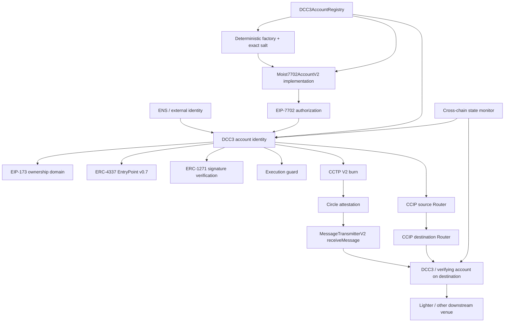

# DCC3 current architecture

## Identity model

DCC3 is the account identity. EIP-7702 is an execution/delegation mechanism used by that account; it is not the account name or identity.

The canonical delegated implementation is `Moist7702AccountV2`. The implementation is deployed deterministically through the retained factory and exact factory salt. DCC3 then signs an EIP-7702 authorization pointing its delegation designator to that implementation.

EIP-173 ownership remains a separate control domain through `owner()` / `transferOwnership(address)` and `OwnershipTransferred`.

## Storage and code model

A delegated EIP-7702 account does not use the ERC-1967 implementation slot to identify its delegated implementation. Its account code is expected to have the form:

`0xef0100 || <20-byte delegated implementation>`

The canonical delegated-account namespace is:

`keccak256("moistly.storage.Moist7702Account.v2")`

The monitor reads both this namespace and the ERC-1967 implementation slot so it can distinguish 7702 accounts from legacy ERC-1967 proxies instead of conflating them.

## Cross-chain identity

Each account lineage records:

- account address (DCC3 identity)
- delegated implementation
- deterministic factory
- exact factory salt
- init-code hash
- delegated account storage namespace
- deployment/code status per chain
- native balance per chain
- USDC balance per chain
- ERC-1967 implementation slot value when a legacy proxy is involved

`DCC3AccountRegistry` stores deterministic identity metadata. Live balances and code are always read from the target chain rather than mirrored as trusted registry state.

## CCTP V2

Source chain:

1. DCC3 executes `cctpBurnToVerifyingAccount`.
2. The burn recipient is derived internally from `verifyingAccount()`.
3. `mintRecipient` and `destinationCaller` therefore identify DCC3/the configured verifying account, never the ZK Lighter venue.
4. Circle emits the source message and produces an attestation.

Destination chain:

1. DCC3 calls `cctpFinalizeMint(messageTransmitter, message, attestation)`.
2. `MessageTransmitterV2.receiveMessage` validates the Circle attestation and message replay state.
3. Native USDC is minted to the verifying account encoded in the source message.
4. Only after mint may DCC3 explicitly execute a Lighter deposit or another DeFi action.

## Chainlink CCIP

The delegated account implements a restricted `ccipReceive` surface:

- only the configured CCIP Router may call it;
- every source chain selector has an explicitly trusted source DCC3 account;
- replayed `messageId` values are rejected;
- token delivery terminates at DCC3/verifying account;
- a venue such as Lighter is never configured as the bridge receiver.

## Current flow

## Deployment boundary

Repository code and deterministic deployment scripts are prepared on branch `ChatGPT's-gay`. The actual EIP-7702 authorization must be signed by DCC3. A repository or RPC reader cannot manufacture that authorization without the account signer.
